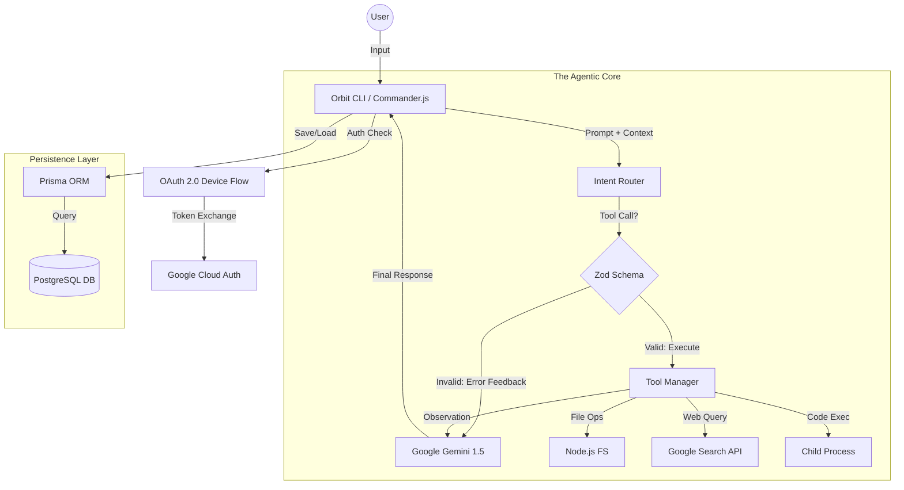
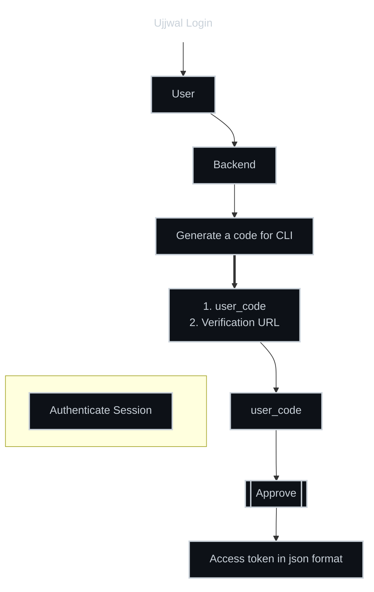

# 🪐 Orbit: The Autonomous AI Agent

**Orbit** is a production-grade autonomous CLI agent designed to bridge the gap between stochastic LLMs and deterministic runtime environments.

Unlike simple "chat" wrappers, Orbit functions as a **Stateful Control Plane** for Google Gemini, capable of complex reasoning, recursive tool execution, and long-term memory via PostgreSQL. It implements the **RFC 8628 OAuth 2.0 Device Authorization Grant** for secure, headless authentication.

---

## 🏗️ System Architecture

Orbit acts as a central orchestrator between the user, the AI model, and the local system. The following diagram illustrates the high-level data flow and component interaction:

## 🔄 The Agentic Workflow (ReAct Loop)

To ensure reliability, Orbit uses a recursive "Reason + Act" loop. It validates every AI-generated argument against a Zod Schema before execution, creating a self-healing error loop.

```mermaid
sequenceDiagram
    participant U as User
    participant A as Agent (Node.js)
    participant L as LLM (Gemini)
    participant T as Tool (System)

    U->>A: "Create a React Component"
    loop ReAct Cycle (Max 10 Iterations)
        A->>L: Send History + Available Tools
        L-->>A: Request: write_file(path, content)
        
        rect rgb(33, 33, 33)
            Note right of A: Validation Phase
            A->>A: Validate args with Zod
        end
        
        alt Arguments Invalid
            A->>L: Error: Invalid JSON format. Fix it.
            Note over L: LLM Self-Corrects
        else Arguments Valid
            A->>T: fs.writeFileSync(...)
            T-->>A: Success (File Created)
            A->>L: Tool Output: "File created successfully"
        end
    end
    L-->>U: "I have created the component."
```

## 🔐 Authentication (RFC 8628)

Orbit relies on a secure, headless authentication flow to manage user sessions without storing sensitive credentials in plain text. The specific flow for session authentication is detailed below:

